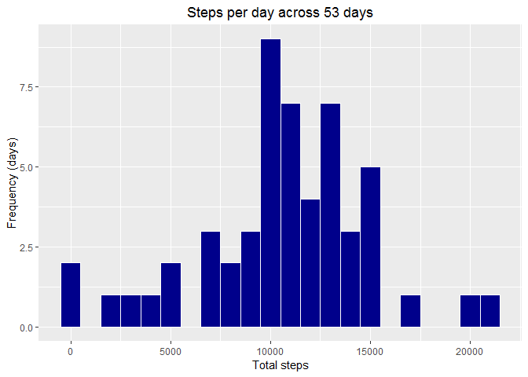
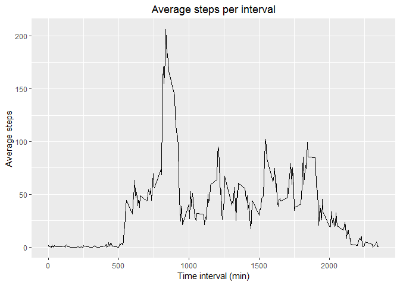
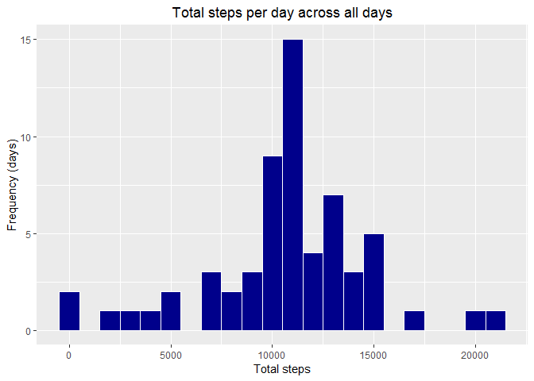
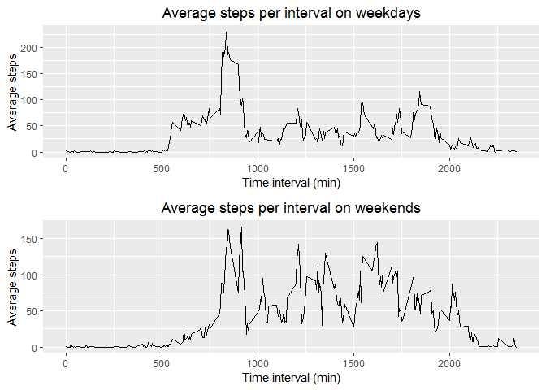

\  

### Loading and preprocessing the data
The following code loads and reformats the date column of our data

```r
library(lubridate)
setwd("C://Users//HaaseE//Documents//R Projects//repdata_data_activity")
activity <- read.csv(file="activity.csv", header=TRUE)
activity$date <- ymd(activity$date)
```


\  

### What is the mean total number of steps taken per day?  

- **Calculate the total number of steps taken per day and create a histogram of the data: **

```r
library(ggplot2)
library(gridExtra)

stepsByDate <- aggregate(steps ~ date, data=activity, sum)
plt <- ggplot(stepsByDate, aes(x=steps)) + 
    geom_histogram(color='white', fill='darkblue', binwidth=1000) +
    labs(title='Steps per day across 53 days', y='Frequency (days)', x='Total steps') +
    theme(plot.title=element_text(hjust=0.5))
plt
```

<!-- -->

- **Calculate and report the mean and median of the total number of steps taken per day: **

```r
medianSteps <- median(stepsByDate$steps)
meanSteps <- mean(stepsByDate$steps)
print(paste('Median number of steps: ', medianSteps), quote=FALSE)
```

```
## [1] Median number of steps:  10765
```

```r
print(paste('Mean number of steps: ', round(meanSteps, digits=2)), quote=FALSE)
```

```
## [1] Mean number of steps:  10766.19
```

\  

### What is the average daily activity pattern?

- **Calculate the average number of steps taken per interval across all days and create a line plot of the data: **

```r
avgDailyActivity <- aggregate(steps ~ interval, data=activity, mean)
plt <- ggplot(data=avgDailyActivity, aes(x=interval, y=steps)) + 
    geom_line() +
    labs(x='Time interval (min)', y='Average steps', title='Average steps per interval') +
    theme(plot.title=element_text(hjust=0.5))
plt
```

<!-- -->

- **Find the interval with the maximum amount of average activity: **

```r
maxInterval <- avgDailyActivity$interval[which.max(avgDailyActivity$steps)]
print(paste('Interval with largest mean number of steps per day: ', maxInterval), quote=FALSE)
```

```
## [1] Interval with largest mean number of steps per day:  835
```

\  

### Imputing missing values
- **Calculate and report the total number of observations with missing values in the dataset: **

```r
naCount <- sum(!complete.cases(activity))
print(paste('Rows with missing values: ', naCount), quote=FALSE)
```

```
## [1] Rows with missing values:  2304
```

- **Fill in these missing values with the average of all other days' activity during that interval: **     

NA values will be replaced with mean steps for that interval on days for which the data was available

```r
naIdx <- which(is.na(activity$steps))
activityImputed <- activity

for (i in naIdx) {
    activityImputed$steps[i] <- round(avgDailyActivity$steps[avgDailyActivity$interval == 
                                                             activityImputed$interval[i]])
}
```

- **Create a histogram of the total number of steps taken each day for the corrected dataset: **

```r
stepsByDateImputed <- aggregate(steps ~ date, data=activityImputed, sum)

plt <- ggplot(stepsByDateImputed, aes(x=steps)) + 
    geom_histogram(color='white', fill='darkblue', binwidth=1000) +
    labs(title='Total steps per day across all days', y='Frequency (days)', x='Total steps') +
    theme(plot.title=element_text(hjust=0.5))
plt
```

<!-- -->

- **Calculate and report the mean and median of the total number of steps taken per day of corrected dataset: **

```r
medianStepsImputed <- median(stepsByDateImputed$steps)
meanStepsImputed <- mean(stepsByDateImputed$steps)
print(paste('Median number of steps: ', medianStepsImputed), quote=FALSE)
```

```
## [1] Median number of steps:  10762
```

```r
print(paste('Mean number of steps: ', round(meanStepsImputed, digits=2)), quote=FALSE)
```

```
## [1] Mean number of steps:  10765.64
```
The median and mean of the total steps per day lowered due to the inclusion of imputed values for NAs rather than omitting them.

\  

### Are there differences between weekdays and weekends?
- **Add additional variable to dataset to indicate if date is a weekday or during the weekend: **

```r
library(dplyr)
weekday <- c("Monday", "Tuesday", "Wednesday", "Thursday", "Friday")
activityImputed <- mutate(activityImputed, dayType = as.factor(ifelse(weekdays(date) %in% weekday, "weekday", "weekend")))
```

- **Create a panel plot showing the average steps per interval on weekdays vs weekends: **

```r
avgDailyActivity <- aggregate(steps ~ interval + dayType, data=activityImputed, mean)

plt1 <- ggplot(data=avgDailyActivity[avgDailyActivity$dayType=="weekday",], aes(x=interval, y=steps)) + 
    geom_line() +
    labs(x='Time interval (min)', y='Average steps', 
         title='Average steps per interval on weekdays') +
    theme(plot.title=element_text(hjust=0.5))

plt2 <- ggplot(data=avgDailyActivity[avgDailyActivity$dayType=="weekend",], aes(x=interval, y=steps)) + 
    geom_line() +
    labs(x='Time interval (min)', y='Average steps', 
         title='Average steps per interval on weekends') +
    theme(plot.title=element_text(hjust=0.5))

grid.arrange(plt1, plt2, nrow=2)
```

<!-- -->
